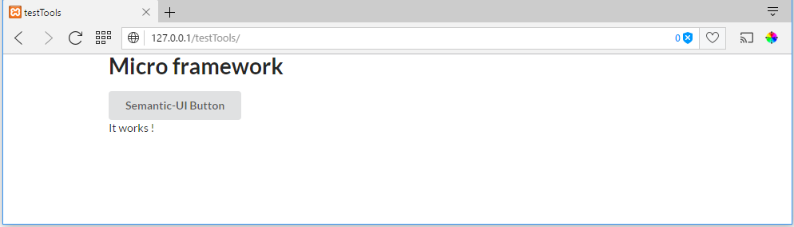

Project configuration
=====================
Normally, the installer limits the modifications to be performed in the configuration files and your application is operational after installation

Main configuration
------------------
The main configuration of a project is localised in the ``app/conf/config.php`` file.

.. code-block:: php
   :linenos:
   :caption: app/conf/config.php
   
   return array(
   		"siteUrl"=>"%siteUrl%",
   		"database"=>[
   				"dbName"=>"%dbName%",
   				"serverName"=>"%serverName%",
   				"port"=>"%port%",
   				"user"=>"%user%",
   				"password"=>"%password%"
   		],
   		"namespaces"=>[],
   		"templateEngine"=>'Ubiquity\views\engine\Twig',
   		"templateEngineOptions"=>array("cache"=>false),
   		"test"=>false,
   		"debug"=>false,
   		"di"=>[%injections%],
   		"cacheDirectory"=>"cache/",
   		"mvcNS"=>["models"=>"models","controllers"=>"controllers"]
   );

.. info::
   
   You can also use **devtools** (at the command prompt) to view or modify the configuration :
   
   .. code-block:: bash
   
      Ubiquity config
   
   .. code-block:: bash
      
       Ubiquity config:set --database.dbName=blog

     
Services configuration
----------------------
Services loaded on startup are configured in the ``app/conf/services.php`` file.

.. code-block:: php
   :linenos:
   :caption: app/conf/services.php
   
	use Ubiquity\controllers\Router;
	
	try{
		\Ubiquity\cache\CacheManager::startProd($config);
	}catch(Exception $e){
		//Do something
	}
	\Ubiquity\orm\DAO::startDatabase($config);
	Router::start();
	Router::addRoute("_default", "controllers\\IndexController");
Pretty URLs
-----------
Apache
^^^^^^
The framework ships with an **.htaccess** file that is used to allow URLs without index.php. If you use Apache to serve your Ubiquity application, be sure to enable the **mod_rewrite** module.

.. code-block:: bash
   :caption: .htaccess
   
   AddDefaultCharset UTF-8
   <IfModule mod_rewrite.c>
   	RewriteEngine On
   	RewriteBase /blog/
   	RewriteCond %{REQUEST_FILENAME} !-f  
   	RewriteCond %{HTTP_ACCEPT} !(.*images.*)
   	RewriteRule ^(.*)$ index.php?c=$1 [L,QSA]
   </IfModule>

See :doc:`Apache configuration</config/server>` for more.

Nginx
^^^^^
On Nginx, the following directive in your site configuration will allow "pretty" URLs:

.. code-block:: php
   
   location /{
         rewrite ^/(.*)$ /index.php?c=$1 last;
   }

See :doc:`NginX configuration</config/server>` for more.

Laravel Valet Driver
^^^^^

Valet is a php development environment for Mac minimalists. No ``Vagrant``, no ``/etc/hosts`` file. You can even share your sites publicly using local tunnels.

Laravel Valet configures your Mac to always run ``Nginx`` in the background when your machine starts. Then, using ``DnsMasq``, Valet proxies all requests on the ``*.test`` domain to point to sites installed on your local machine.

Get more info about `Laravel Valet <https://laravel.com/docs/5.8/valet>`_ 

Create ``UbiquityValetDriver.php`` under ``~/.config/valet/Drivers/`` add below php code and save it.

.. code-block:: php

	<?php

	class UbiquityValetDriver extends BasicValetDriver{

		/**
		* Determine if the driver serves the request.
		*
		* @param  string  $sitePath
		* @param  string  $siteName
		* @param  string  $uri
		* @return bool
		*/
		public function serves($sitePath, $siteName, $uri){
			if(is_dir($sitePath . DIRECTORY_SEPARATOR . '.ubiquity')) {
				return true;
			}
			return false;
		}

		public function isStaticFile($sitePath, $siteName, $uri){
			if(is_file($sitePath . $uri)) {
				return $sitePath . $uri;
			}
			return false;
		}

		/**
		* Get the fully resolved path to the application's front controller.
		*
		* @param  string  $sitePath
		* @param  string  $siteName
		* @param  string  $uri
		* @return string
		*/
		public function frontControllerPath($sitePath, $siteName, $uri){
			$sitePath.='/public';
			$_SERVER['DOCUMENT_ROOT'] = $sitePath;
			$_SERVER['SCRIPT_NAME'] = '/index.php';
			$_SERVER['SCRIPT_FILENAME'] = $sitePath . '/index.php';
			$_SERVER['DOCUMENT_URI'] = $sitePath . '/index.php';
			$_SERVER['PHP_SELF'] = '/index.php';
			
			$_GET['c'] = '';
			
			if($uri) {
				$_GET['c'] = ltrim($uri, '/');
				$_SERVER['PHP_SELF'] = $_SERVER['PHP_SELF']. $uri;
				$_SERVER['PATH_INFO'] = $uri;
			}

			$indexPath = $sitePath . '/index.php';

			if(file_exists($indexPath)) {
				return $indexPath;
			}
		}
	}
