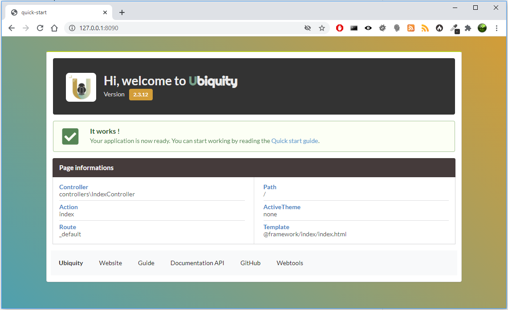
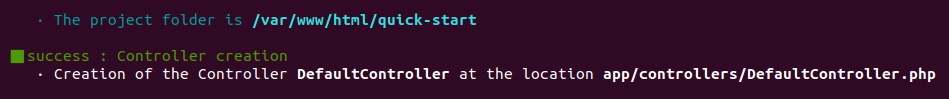
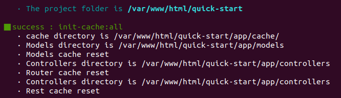
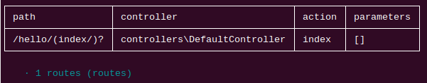
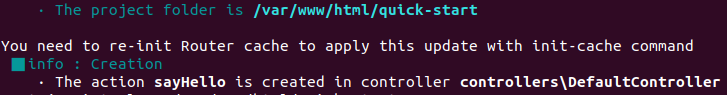
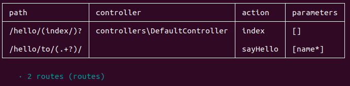

Quick start guide
=================

Install Composer
----------------
**ubiquity** utilizes Composer to manage its dependencies. So, before using, you will need to make sure you have `Composer <http://getcomposer.org/>`_ installed on your machine.

Install Ubiquity-devtools
-------------------------
Download the Ubiquity-devtools installer using Composer.

.. code-block:: bash
   
   composer global require phpmv/ubiquity-devtools
   
Project creation
----------------
Create the **quick-start** projet with UbiquityMyAdmin interface and Semantic-UI integration

.. code-block:: bash
   
   Ubiquity new quick-start -q=semantic -a

Directory structure
-------------------
The project created in the **quick-start** folder has a simple and readable structure:

the **app** folder contains the code of your future application:
  
.. code-block:: bash
   
   app
    ├ cache
    ├ config
    ├ controllers
    ├ models
    └ views
   
Start-up
--------
Go to the newly created folder **quick-start** and start the build-in php server:

.. code-block:: bash
   
   Ubiquity serve
   
Check the correct operation at the address **http://127.0.0.1:8090**:

.. note:: If port 8090 is busy, you can start the server on another port using -p option.

.. code-block:: bash
   
   Ubiquity serve -p=8095
   

Controller
----------

The console application **dev-tools** saves time in repetitive operations.
We go through it to create a controller.

.. code-block:: bash
   
   Ubiquity controller DefaultController
   

We can then edit ``app/controllers/DefaultController`` file in our favorite IDE:

.. code-block:: php
   
   namespace controllers;
    /**
    * Controller DefaultController
    **/
   class DefaultController extends ControllerBase{
   
    	public function index(){}
   
   }

Add the traditional message, and test your page at ``http://127.0.0.1:8090/DefaultController``

.. code-block:: php
   
	class DefaultController extends ControllerBase{
	
		public function index(){
			echo 'Hello world!';
		}
	
	}
   
For now, we have not defined routes,|br|
Access to the application is thus made according to the following scheme: |br|
``controllerName/actionName/param``

The default action is the **index** method, we do not need to specify it in the url.

Route
-----
The routing is defined with the annotation ``@route`` and is not done in a file of configuration: |br|
it's a design choice.
The **automated** parameter set to **true** allows the methods of our class to be defined as sub routes of the main route ``/hello``.

.. code-block:: php
   
	namespace controllers;
	 /**
	 * Controller DefaultController
	 * @route("/hello","automated"=>true)
	 **/
	class DefaultController extends ControllerBase{
	
		public function index(){
			echo 'Hello world!';
		}
	
	}
	
Router cache
^^^^^^^^^^^^
No changes on the routes are effective without initializing the cache. |br|
Annotations are never read at runtime. This is also a design choice.

We can use the console for this purpose:

.. code-block:: bash
   
   Ubiquity init-cache

Let's check that the route exists:

.. code-block:: bash
   
   Ubiquity info:routes

We can now test the page at ``http://127.0.0.1:8090/hello``

Action & route with params
--------------------------
We will now create an action (sayHello) with a parameter (name), and the associated route (to): |br|
The route will use the name parameter of the action
.. code-block:: bash
	Ubiquity action DefaultController.sayHello -p=name -r=to/{name}/
	

After re-initializing the cache (**init-cache** command), the **info:routes** command should display:

Change the code in your IDE: the action must say Hello to somebody...

.. code-block:: php

	/**
	 *@route("to/{name}/")
	**/
	public function sayHello($name){
		echo 'Hello '.$name.'!';
	}

and test the page at ``http://127.0.0.1:8090/hello/to/Mr SMITH``
